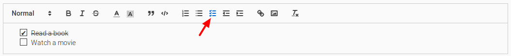

[](https://badge.fury.io/js/quill-task-list)

# Task list for quill

Adds a task / todo list to the quill editor. Behaves as the built-in bullet
list.
Includes a toolbar item.

The list items are clickable. A click on an item toggles the item as checked.



Quill doesn't have a built-in checkbox list
([yet](https://github.com/quilljs/quill/issues/759)).
This is a pretty lazy plugin that adds support for that. It's [not a very
sophisticated solution](#todo) but works sufficiently well for now.

## Install

```
npm i quill-task-list
```
or
```
yarn add quill-task-list
```

## Usage

1. Require or import the JavaScript and the SASS file in your interwebs page,
   after the main quill.js.
1. Configure the module when instantiating quill

```javascript
this.editor = new Quill('#editor', {
  modules: {
    'toolbar': [ 'task-list' ],
    'task-list': true
  }
});
```

You can see the plugin in action in [Mykonote](https://github.com/panter/mykonote).

## TODO

* For now the click triggers a dummy update, because the css class toggle
  doesn't trigger a change in quill. The proper way would be to change the
  state of the item by using a delta directly and maybe two kinds of list item
  classes (a normal `TaskListItem` and a `CheckedTasklistItem` or something.
  Fixing this would also fix the history.  This may be easy for someone
  familiar with the internals of quill.

## License

[BSD 3-clause](LICENSE) (the same one that
[Quill](https://github.com/quilljs/quill) uses)
